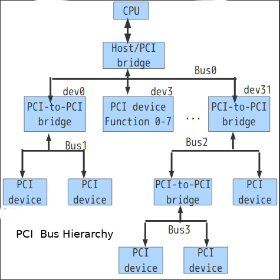
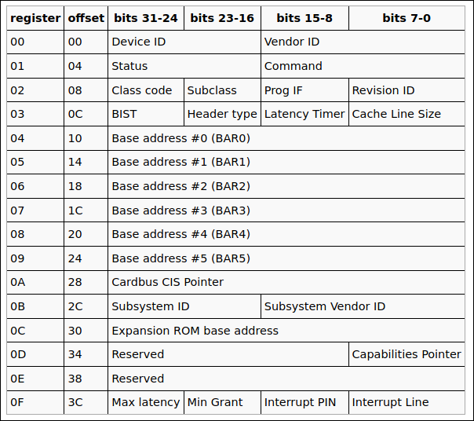
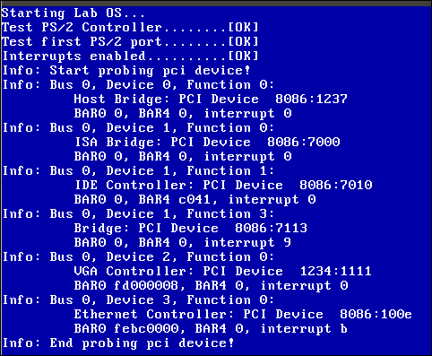
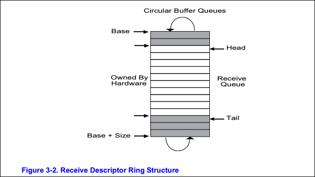
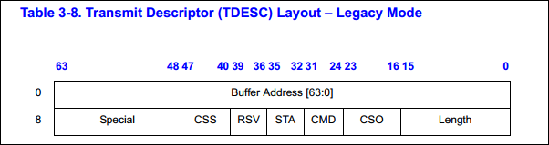

## Lab 6
1. simple PCI driver
2. NE200 simple driver

## PCI Bus
PCI supports 3 address spaces:  
1. PCI config space
2. I/O space
3. MMIO space

- Each device connected on the PCI bus exhibit a **256 Bits Configration Space**. use 0xCF8 and 0x0CFC ports to retrieve it.  

- A device on PCI bus is identified by his (vendorID, deviceID).

  

**PCI bus hierarchy**  
  

**PCI Configuration space**  
256 bytes are assigned to each device function. 8 functions per device/slot/card and 32 devices per bus can exist in maximum.

Two mechanisms to access configuration space on x86 PC:  
- Through I/O ports :
   - **0xCF8** – PCI CONFIG_ADDRESS
   - **0xCFC** – PCI CONFIG_DATA 
- MMIO

**PCI CONFIG ADDRESS**    

There may be 256 PCI bus. 32 devices can be connected on each bus. a device can handle 8 functions.  

**BAR : base address register**  
Indicate base address for  IO or DMA communication with this device.  

**IRQ Handling**  
Easy in the case of the old PIC, you have the  

**Interrupt Line field** of the header, which is read/write (you can change it's value!).  
If you plan to use I/O APIC, it is complicated!!

PCI List in LabOS  

**Linux PCI list**  

    > lspci

**PCI list by Qemu Monitor**
    
     > info pci

## E1000 NIC
[Intel Ethernet Controller 8254x GBe](https://pdos.csail.mit.edu/6.828/2019/readings/hardware/8254x_GBe_SDM.pdf)

- Intel PCIe compaibility : PCIe is completely compatible with existing deployed PCI software.

- Memory-Mapped Access to Internal Registers and Memories  
The internal registers and memories can be accessed as direct memory-mapped offsets
from the Base Address Register 0 (BAR0).

- When an I/O BAR is mapped, the I/O address range allocated opens a 32-byte window
in the system I/O address map. Within this window, two I/O addressable registers are
implemented:
 - IOADDR
 - IODATA
The IOADDR register is used to specify a reference to an internal register, memory, or
Flash, and then the IODATA register is used as a window to the register, memory or
Flash address specified by IOADDR:

**Network Stack**  

**EEPROM**   
  Generally a 256bytes  ROM that can  be modified by a special material.  EEPROM stores configuration data for the controller.

  [eeprom-map-appl-note](https://www.intel.ru/content/dam/doc/application-note/82559-eeprom-map-appl-note.pdf) 

  

**MAC**  
  if EEPROM exist, than it contains the MAC address  
  else read the MAC from addr 0x5400???

**Receive Descriptor**  

**Receive Descriptor Queue Structure**   

**Transimit Descriptor**  

## Ethernet, ARP, IP, TCP

-**Segments** are units of data in the Transport Layer (TCP/UDP in case of the Internet)  
-**Packets** are units of data in the Network Layer (IP in case of the Internet)  
-**Frames** are units of data in the Link Layer (e.g. Wifi, Bluetooth, Ethernet, etc).  

- Network debug:
  1. Run Qemu with option "filter-dump" to dump network trafic on a file
  2. use wireshark (option -r) to read from file
  3. Activate Validate checksum : check option in wireshark->preference->protocols->IPv4, Ethernet,etc 

### Bridge and Tap

**Create a bridge tap** : to reach Qemu  
  
   $ tools/bridge-tap.sh [add|del]

    

## References
MUST:
- Intel Ethernet 8254x GBe : https://pdos.csail.mit.edu/6.828/2019/readings/hardware/8254x_GBe_SDM.pdf
- https://wiki.osdev.org/PCI   
- https://wiki.osdev.org/Intel_Ethernet_i217
- https://pdos.csail.mit.edu/6.828/2017/labs/lab6/
  
Others:
- http://www.mnc.co.jp/english/INtime/faq07-2_kanren/PCIconfigurationregister.htm
- EEPROM : https://www.intel.ru/content/dam/doc/application-note/82559-eeprom-map-appl-note.pdf
- Linux code browser: https://elixir.bootlin.com/linux/latest/source
- PCI IDS :http://pciids.sourceforge.net/v2.2/pci.ids
- http://www6.uniovi.es/LDP/LDP/LGNET/156/jangir.html