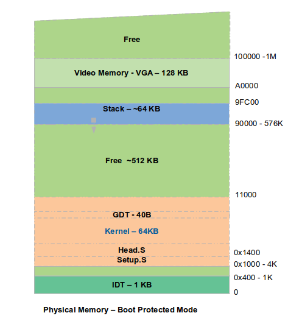
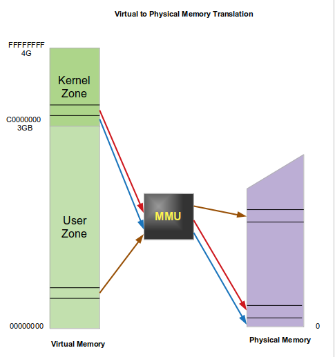

## Lab 3
1. Makefile must link(ld) kernel code at 0xC0010000(3GB+0x10000), kernel will be loaded at phy addr 0x10000 .

2. bootSector jump to *setup.S*  at 0x10000 (far jump).

2. Setup.S save mem size  at INITSEG (0x90000), using bios INT 15H.

3. Setup.S intialize:   

   - A temporary GDT- Global diretory table.  
   - GDTR register pointe on GDT.  
   - GDT is used for SEGMENTATION.  

4. Then switch to the Protected Mode.

5. From now, BIOS will never be used, and may be overwritten.

6. Then we passes control to Kernel Main(C program).

**Memory Adressing**  

logical addr = linear addr = physical addr.

We choose flat model segmentation. Two segments are defined, CS and DS. Segment descriptors are defined in GDT. 
both are with base=0 and limit=FFFFFFFF, so they use all virtual space(4GB).  

**GDT** : Global directory table.   
Temporary! this is only used for transition between real and protected mode. the definitive
GDT will be created in the next step. GDT physical address is stored in **GDTR** register. 

We use GDT to map logical addr to linear addr. 

Tow segment descriptorw will be defined: CS and DS. with base=0, limit=4GB,, DPL=0.     

**Switching to Protected Mode**: see Intel Architecture - System programming guide 
1. Disable interrupt: CLI
2. Load GDTR with base addr of GDT: LGDT intruction  
3. set bit 0(PE flag) in CR0: mov CR0
4. execute a far jump: jmp segment:addr
5. reload segments DS, ES, FS, GS with new values
6. STI

**Debugging protected mode** 
  ~~~
  $ cp ~/magOS/tools/gdbinit_asm.txt ~/.gdbinit
  $ edit ~/magOS/tools/gdb-user.cmd 

  $ ~/magOS/Labs/run-qemu-Lab.sh 3 -g

  $ gdb -x ~/magOS/tools/gdb-user.cmd 
  ~~~

## Protected Mode 
 Section 9.8 in **Intel Architecture - System Programming Guide Vol 3**  

**Physical Memory Layout in protected mode**  
  

**Segmentation and paging**  
  

**Memory Management Registers**  
  

**Segmentation: Flat Model**  
  

**Segmentation: Protected Flat Model**  
  

**Segment Descriptor**  
  

**Paging**  
  

**Virtual(logical) To Physical Memory Translation**  
  
