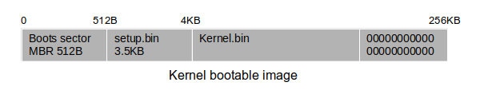
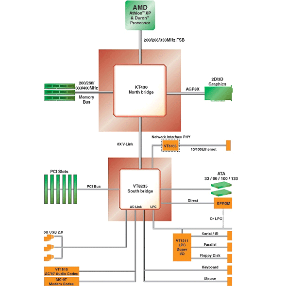
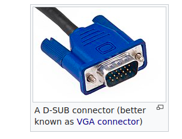

## Lab 4
1. Enter the Kernel calling Main.c (Kernel)
2. Write console driver, to write text on the console

**Kernel bootable image**  

##  Cirrus CL-GD5446 PCI VGA card
See **CL-GD5446 technical manual reference**  
- Emulated by Qemu
- it is compabible with IBM VGA hardware
- CRTC controller registers
  - CRTC index and data : **3D4-3D5** when CL-GD5446 is programmed for color.

**Example of setting cursor location**  

**Example of setting screen start address**  

**Video RAM**:  
From  0xB8000 to 0xBF000. 0xB8000 is the base of color video/text memory(32KB).

**Console properties**:  
color text mode. 16 colors. 80 rows and 25 columns. the VGA mode is set BIOS(bootSect.S). 

**VGA Character arrangement**  

**Cirrus CL-GD5446**    

**PC L-GD5446 subsystem architecture**    

**PC CL-GD5446 functional diagram**    

## Char and Block Driver
**Motherboard: Northbridge KT400**  

**Model of connecting CPU and IO controllers**  

**PC IO architecture**  

**VGA connector**  
