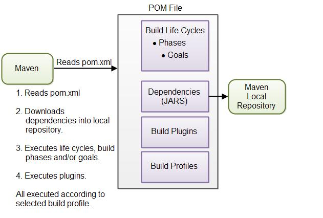
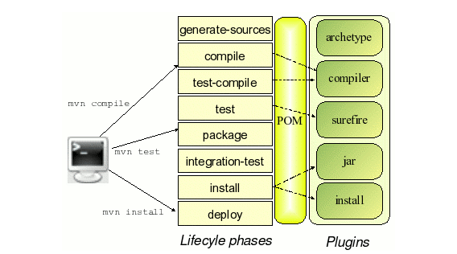

## Maven
How Maven works  

Maven Directory structure  

Plugins   
plugings syntax:   
**mvn [plugin-name]:[goal-name]**  

pluging examples:  
   mvn compiler:compile

Maven lifecycle  

### Hibernate

### JPA 
JPA providers :  
 -**Hibernate**: open source. Red Hat!
 -**TopLink**  : Oracle!. 
 -**EclipseLink**: open source, derivated from oracle TopLink. 
 

### Spring MVC

### Spring DAO

### Spring Security

### Spring AOP

### Spring ORM

### Spring Test

### Spring Boot

### EJB 3

### Web services

## Interfaces
### AngularJS

### JQery 

### Struts

### Spring

