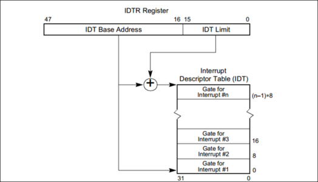

## Interrupts
* Miscellaneous  
  - when an interrupt is handled, IF flag is cleared, which disable maskable interrupts.
  
* Interrupt Types:  
  
  1.1. Hardware interrupts  
  **NMI**: non maskable, received on the processor's NMI# input pin.  
  **INTR**: extern I/O intrrupts. maskable(ignored) if 'IF' flag is clear. received on the processor's INTR# input pin.  
  **Exceptions**: they occur when the processor detect an error while executing an instruction(division by 0, page fault, gpf,etc)

    
  1.2. Software interrupt: generated by "INT n" instruction.

* IDT: table of 256 vectors.   
  0-31 vectors are asigned to NMI and exceptions. non-maskable.  
  32-47 are asigned to material interrupts(IRQ). maskable.  
  48-255 are available for kernel. maskable.  

**IDTR and IDT**  

**IDT descriptor**  

IDT maximum size 256×8=2048=2KB

* Diagramme de sequence pour interruption materielle IRQ_1
~~~
Keyboard    PIC    sys_call.S                           keyboard.c             
  |--------->|         |                                    |
  |          |--INTR-->|                                    |
  |          |         |--irq_1-->|                         |
  |          |         |          |---keyborad_handler----->|
  |          |         |          |                         |
~~~

**ERROR CODE**  
When an exception condition is related to a specific segment, the processor pushes an error code
onto the stack of the exception handler.

## References 
- **Intel Architecture - System Programming Guide.pdf**  

  

