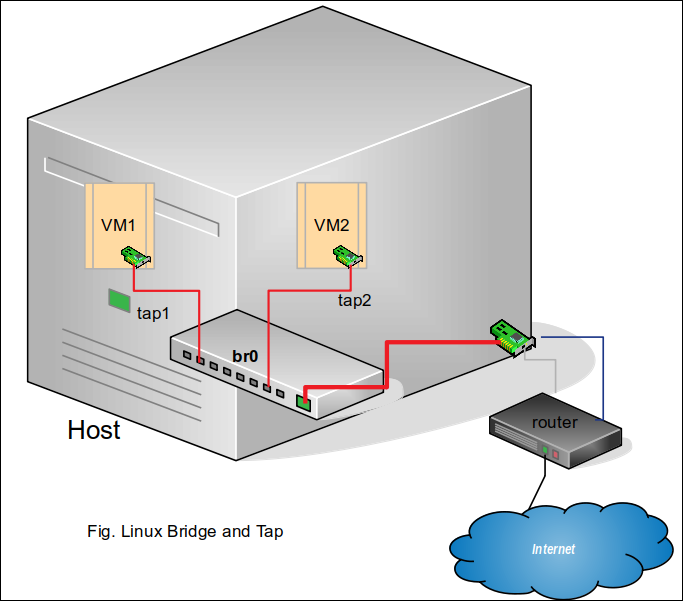

Networking
=================
Ubuntu 

### IP vs Ifconfig
IP is a replacement for ifconfig command. IP command is orginazed on two layers: Link Layer(**ip link**), IP Layer(**ip a**).

Dispalay all NICs   
    
    $ ifconfig                                 
    $ ip a                                        

Add IP address     

    $ ifconfig eth0 add 192.168.43.17          
    $ ip a add 192.168.43.17 dev eth0              

Set MAC            

    $ ifconfig eth0 hw ether ae:09:29:13:43:a3 
    $ ip link set dev eth0 address ae:09:29:13:43:a3

Set MTU            

    $ ifconfig eth0 mtu 1800                   
    $ ip link set dev eth0 mtu 1800                 

Set promiscous     
    
    $ ifconfig eth0 promisc                    
    $ ip link set dev eth0 promisc on               

Enable/Disable NIC 
    
    $ ifconfig eth0 [up down]                  
    $ ip link set eth0 [up dow]                      

### Routing Table
Routing table explained: https://geek-university.com/ccna/routing-table-explained

    # route -n
    Kernel IP routing table
    Destination     Gateway         Genmask         Flags Metric Ref    Use Iface
    0.0.0.0         10.98.56.1      0.0.0.0         UG    100    0        0 enp0s3
    170.56.2.0      10.2.0.1        255.255.255.0   U     100    0        0 enp0s3
    168.254.0.0     0.0.0.0         255.255.0.0     U     1000   0        0 enp0s8

Send to "10.2.0.1"(Gateway) all packets that are destinated to the network 170.56.2.0(from 170.56.2.0 to 
170.56.2.254) by passing by interface enp0s3.

**Default route**: dest=0.0.0.0 and mask=0.0.0.0. route for all packets that don't have a specified route 
in routing table. We use the default route for Internet.

Delete a route:

    # route del default

Add default route

    # route add default gw 10.98.56.1 dev enp0s3

Open connections
	
	netstat -np | grep 8080
	lsof -nPp 2552257 | grep 8080     ; -P : for numerique ports 

	
### TCPDUMP & Wireshark

	tcpdump -v -A -s 0  port 8080 and host 192.168.1.1  -w capt.log   
	
	use Wireshark to read capt.log
	 
	 
### Linux Bridge and Tap

### DHCP
install packet: **isc-dhcp-server**
 
Configuration file: **/etc/dhcp/dhcpd.conf**
 
## FireWalls
-------------------------
### Firewalld : firewall-cmd Utility
Default firewall on CentOS 7.

Stop/Start

	$ systemctl start firewalld

Is firewalld running?

	$ firewall-cmd --state
	running

Defined Firewall Rules: 
> $ firewall-cmd --list-all

> $ firewall-cmd --zone=home --list-all

> $ firewall-cmd --zone=public --list-ports

Open access to HTTP(port 80) service

	$ firewall-cmd --zone=public --permanent  --add-service=http

 	$ firewall-cmd --zone=public --list-services
	
	Output : dhcpv6-client http mdns samba-client ssh

Open a Port on a Zone

	$ firewall-cmd --zone=home --add-port=9990/tcp --permanent 

	$ firewall-cmd --reload

	$ firewall-cmd --zone=home --list-ports
	
	Output: 9990/tcp

Zones: 

	$ firewall-cmd --get-default-zone
	Out: public

Litst of Defined Zones:

	$ firewall-cmd --get-zones
	Out: block dmz drop external home internal public trusted work

Changing the Zone of an Interface

	$ firewall-cmd --zone=home --change-interface=enp0s8 --permanent

	$ firewall-cmd --get-active-zones
	home
  		interfaces: enp0s8
	public
  		interfaces: enp0s3

List of Predefined Services

	$ firewall-cmd --get-services

	... ftp http https ssh ntp ....

See More about a service. eg ssh : **/usr/lib/firewalld/services/ssh.xml**

	<?xml version="1.0" encoding="utf-8"?>
	<service>
  		<short>SSH</short>
	  	<port protocol="tcp" port="22"/>
	</service>

### ufw
ufw is a frontend tool uppon iptables. It aims to simplify the  complicated  iptables rules. 

ufw is the default firewall for ubuntu 20.04

Is Firewall Actif:
> $ ufw status

Enable/Start the Firewall:
> $ ufw enable

Allow Incoming on 80 port: 
> $ ufw allow 80/tcp

List of Defined Rules:
> $ ufw status verbose

Delete a Rule:
> $ ufw status numbered

> $ ufw delete 1

Activate Journalisation:
> $ ufw logging on

### Iptables
Current Rules:
> $ iptables -L

Add a Rule
> $ iptables -A INPUT -p tcp --dport ssh -j ACCEPT

Delete a Rule:
> $ iptables -L --line-numbers

> $ iptables -D INPUT 1
