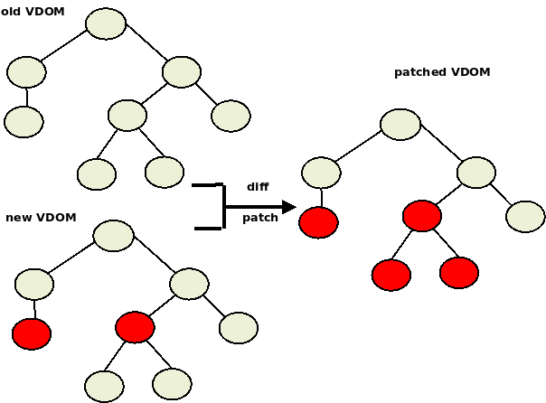

#### DOM manipulation is slow
L'acces et la mise a jour de l'arbre DOM est rapide, la lenteur vient du rafraichissement de l'UI.

#### Virtual DOM
Virtual DOM is a javascript lightweight representation of the DOM. In this project I construct this 
simple VDOM from scratch. steps(see ./app.js):
1. Use VNode class to contruct a VDOM tree.
  ~~~js
  let vh2 = createTextVNode('h2', {id:'h1', style:"color:red"}, 'Villes')

  let vDiv1 = createTextVNode('div', {id:'div1'}, 'Demo for virtual dom from scratch!')

  let vApp = createVNode('div', {id:'vapp'})
  vApp.appendChild(vh2).appendChild(vul).appendChild(vHr).appendChild(vDiv1)
  ~~~

2. In `index.html` declare the root elment where the VDOM will  mounted
~~~html
  <body>
    

~~~

3. Mount the VDOM on the real DOM
~~~js
  const _app = document.getElementById("app")
  mount (vApp, _app)   
~~~

4. How to differ and patch two VDOM?
~~~js
    const clonedVApp = vApp.clone() 
    let vDiv2 = createTextVNode('div', {id:'div2'}, 'Diffing TEST!')
    vApp.replaceChild(vDiv1, vDiv2)
    diff(clonedVApp, vApp)
~~~

#### Diff and Patch VDOM

#### Coding
- we prepend variables with
  - `_`  for reel DOM, eg _div, _app
  - `v`  for virtual DOM, eg vDiv

#### Environment
- Visual Studio Code
- `Live Server` extension

#### Reference
- [DOM official specs] (https://dom.spec.whatwg.org)
- [DOM API] (https://developer.mozilla.org/fr/docs/Web/API/Document)
- https://dev.to/ycmjason/building-a-simple-virtual-dom-from-scratch-3d05
- https://marc.dev/blog/vue-2-from-scratch-part-2/
- https://blog.10pines.com/2018/08/27/reactjs-virtual-dom/